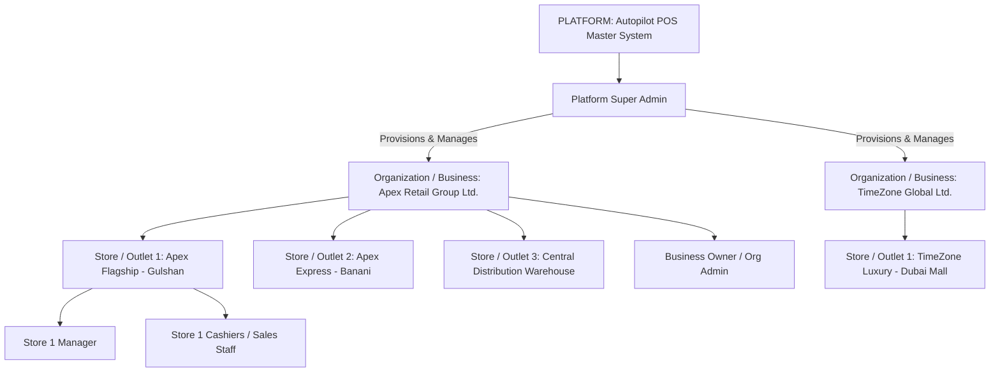
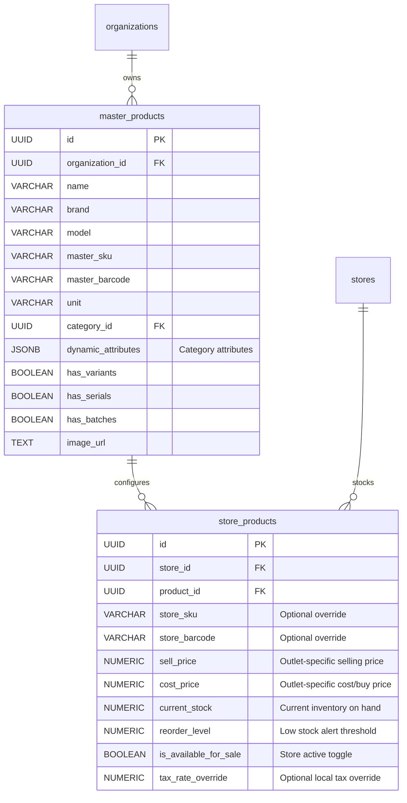
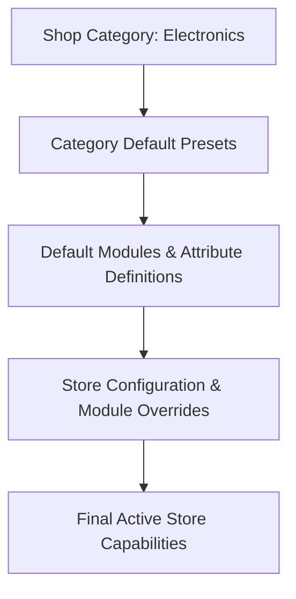
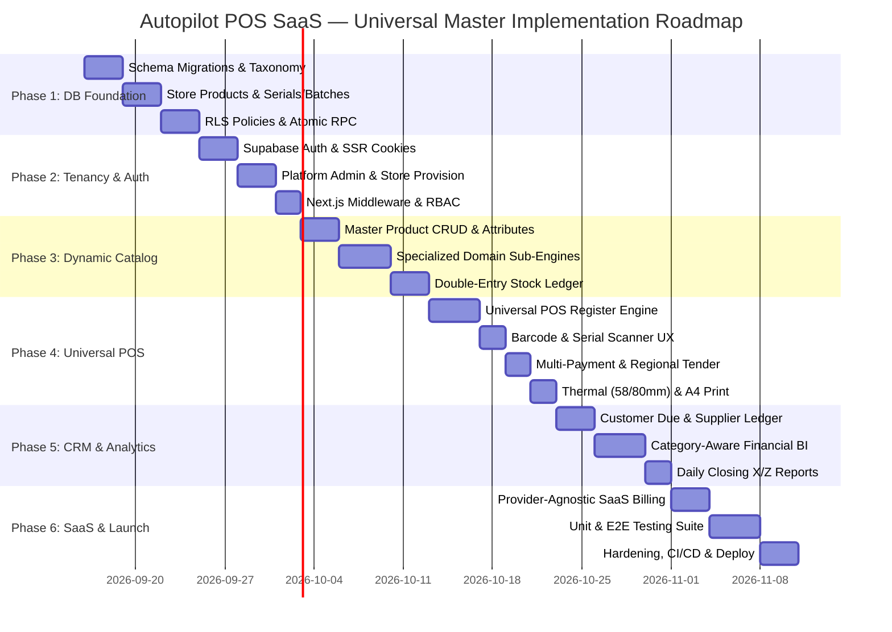

# Autopilot POS SaaS — Universal Master Architecture & Product Specification
## Enterprise Multi-Tenant & Multi-Category Retail Platform Blueprint

**Document Version:** 3.1.0 (Master Baseline Finalized)  
**Status:** Approved Architectural Baseline  
**Date:** September 15, 2026  
**Target Platform:** Next.js 16 (App Router), React 19, TypeScript 5, Tailwind CSS 4, PostgreSQL 15+ / Supabase, Vercel  

---

## Table of Contents
1. [Executive Vision & Master Architectural Formula](#1-executive-vision--master-architectural-formula)
2. [Tenancy & Organizational Hierarchy: Business vs. Store Outlets](#2-tenancy--organizational-hierarchy-business-vs-store-outlets)
3. [Product Catalog Architecture: Organization Master vs. Store Operations](#3-product-catalog-architecture-organization-master-vs-store-operations)
4. [Shop Category vs. Module System (Clear Separation of Concerns)](#4-shop-category-vs-module-system-clear-separation-of-concerns)
5. [Modular Capability & Feature Flag System](#5-modular-capability--feature-flag-system)
6. [Dynamic Product Attributes & Hybrid Schema Model](#6-dynamic-product-attributes--hybrid-schema-model)
7. [Specialized Domain Sub-Engines (Serials/IMEIs, Batches, Matrix Variants, Future Jewelry)](#7-specialized-domain-sub-engines-serialsimeis-batches-matrix-variants-future-jewelry)
8. [Internationalization, Currency & Regional Architecture](#8-internationalization-currency--regional-architecture)
9. [Provider-Agnostic SaaS Subscription & Entitlements Engine](#9-provider-agnostic-saas-subscription--entitlements-engine)
10. [Multi-Template Receipt & Invoice Architecture (58mm, 80mm, A4)](#10-multi-template-receipt--invoice-architecture-58mm-80mm-a4)
11. [Complete PostgreSQL Relational Schema & Tenant Isolation](#11-complete-postgresql-relational-schema--tenant-isolation)
12. [Database Migration Strategy (Supabase CLI)](#12-database-migration-strategy-supabase-cli)
13. [Row Level Security (RLS) & Permission Enforcement](#13-row-level-security-rls--permission-enforcement)
14. [Atomic POS Concurrency Engine (`create_sale_atomic`)](#14-atomic-pos-concurrency-engine-create_sale_atomic)
15. [Double-Entry Inventory & Stock Movement Ledger](#15-double-entry-inventory--stock-movement-ledger)
16. [Customer CRM, Receivables & Supplier Procurement](#16-customer-crm-receivables--supplier-procurement)
17. [Category-Aware Analytics & Financial Reporting](#17-category-aware-analytics--financial-reporting)
18. [API & Next.js Server Action Architecture](#18-api--nextjs-server-action-architecture)
19. [Security, Threat Modeling & Invariants](#19-security-threat-modeling--invariants)
20. [Performance, Caching & Scalability Strategy](#20-performance-caching--scalability-strategy)
21. [Testing, Quality Assurance & CI/CD Pipeline](#21-testing-quality-assurance--cicd-pipeline)
22. [Extensibility Strategy: Configuration vs. Specialized Modules](#22-extensibility-strategy-configuration-vs-specialized-modules)
23. [Architectural Decision Records (ADRs)](#23-architectural-decision-records-adrs)
24. [Phased Implementation Roadmap & Execution Plan](#24-phased-implementation-roadmap--execution-plan)

---

## 1. Executive Vision & Master Architectural Formula

### 1.1 Universal SaaS Philosophy
**Autopilot POS SaaS** is an enterprise-grade, cloud-native **Universal Master Retail Point of Sale (POS) and Operations Platform**. It is not restricted to any single retail niche and not restricted to any single country or currency. From a single codebase and unified database, the platform powers retail businesses across diverse commercial sectors worldwide (Watches, Electronics, Mobile Phones, Cosmetics, Fashion, Grocery, Hardware, Jewelry, and General Retail).

### 1.2 The Master Architectural Formula
$$\mathbf{Universal\ Master\ POS} = \begin{matrix} \mathbf{Core\ POS\ Engine} \\ + \\ \mathbf{Multi\text{-}Tenancy\ (Platform \rightarrow Business/Org \rightarrow Store/Outlet)} \\ + \\ \mathbf{Product\ Master\ Catalog\ (Org\ Level)} \\ + \\ \mathbf{Store\ Operations\ (Pricing,\ Stock,\ Reorder)} \\ + \\ \mathbf{Shop\ Category\ Presets} \\ + \\ \mathbf{Modular\ Capability\ System} \\ + \\ \mathbf{Dynamic\ Attributes} \\ + \\ \mathbf{Specialized\ Domain\ Modules} \end{matrix}$$

---

## 2. Tenancy & Organizational Hierarchy: Business vs. Store Outlets

To ensure unambiguous domain boundaries, the platform strictly separates the legal business entity from its physical operational outlets:



### 2.1 Explicit Domain Definitions
- **Organization / Business (`organizations`):** The top-level legal tenant and account holder. Owns the SaaS subscription, billing contract, company profile, global customer/supplier relationships, and the **Product Master Catalog**.
- **Store / Outlet (`stores`):** A distinct physical shop, retail boutique, kiosk, or warehouse belonging to an Organization. Maintains local inventory quantities, outlet-specific selling prices, cash registers, cashier shifts, local tax settings, and receipt layouts.
- **Users / Staff (`user_profiles`, `organization_members`, `store_members`):**
  - **Organization Owner / Admin:** Full authority over the entire business, billing, all store outlets, user invitations, and consolidated reporting.
  - **Store Manager:** Full operational control over assigned store outlets (local pricing, inventory receiving, physical audits, customer debt collection, cashier shift sign-off).
  - **Cashier / Sales Staff:** Fast checkout, barcode/serial scanning, receipt printing, customer lookup. Strictly blocked from viewing cost prices, changing tax rules, or viewing overall profit margins.
  - **Inventory Clerk:** Stock counts, receiving purchase shipments, logging damaged/expired goods.

---

## 3. Product Catalog Architecture: Organization Master vs. Store Operations

The product architecture cleanly separates **Product Identity** (Organization level) from **Product Operations** (Store level), supporting both single-store shops and large multi-store retail chains:



### 3.1 Architectural Capabilities
1. **Single-Store Businesses:** Onboarding is instantaneous—adding a product to the master catalog automatically provisions the 1:1 `store_products` operational record.
2. **Multi-Store Businesses:** An organization defines "Rolex Submariner Date" or "Nike Air Max 90" once in the `master_products` catalog. Store 1 (Flagship) can sell it at `$10,500` with 3 units in stock, while Store 2 (Outlet) can sell it at `$9,800` with 1 unit in stock, without duplicating master product definitions.

---

## 4. Shop Category vs. Module System (Clear Separation of Concerns)

To avoid hardcoded category lock-in, we strictly separate **Shop Categories** from **Capabilities (Modules)**:

$$\begin{matrix} \mathbf{Shop\ Category} & = & \text{Default Business-Type Blueprint / Preset} \\ \mathbf{Modules} & = & \text{Individual Functional Capabilities (Togglable)} \end{matrix}$$



### 4.1 Execution Pipeline
1. **Category Selection at Store Creation:** When a store is created, Platform Admin selects a mandatory `shop_category` (e.g. *Watches, Cosmetics, Electronics*).
2. **Initialization of Presets:** The system copies default attribute definitions and default active modules from the category blueprint into the store's configuration.
3. **Store Admin Customization:** The Store Admin can override module flags (e.g. an Electronics shop that also sells accessories can enable Matrix Variants, or a Fashion shop can disable Loyalty).
4. **No Permanent Lock-In:** Changing or customizing modules never requires changing core POS transaction code.

---

## 5. Modular Capability & Feature Flag System

The platform features 20 pluggable capability flags stored in `stores.enabled_modules JSONB`:

| Module Code | Module Name | Primary Responsibility | Default Active Categories |
|---|---|---|---|
| `mod_pos` | POS Register Terminal | High-speed sales capture, cart, multi-tender | **All Categories (Universal)** |
| `mod_products` | Product Catalog | Master catalog, brands, categories, units | **All Categories (Universal)** |
| `mod_inventory` | Double-Entry Inventory | Stock tracking, adjustments, min-stock alerts | **All Categories (Universal)** |
| `mod_sales` | Sales & Invoicing | Order history, invoice generation, refunds | **All Categories (Universal)** |
| `mod_customers` | Customer CRM & Dues | Customer profiles, credit ledger, receivables | **All Categories (Universal)** |
| `mod_suppliers` | Supplier Procurement | Supplier database, payables, PO tracking | **All Categories (Universal)** |
| `mod_expenses` | Expense Management | Operational expense logging, categorization | **All Categories (Universal)** |
| `mod_reports` | Business Analytics | P&L, Daily closing (X/Z), sales performance | **All Categories (Universal)** |
| `mod_returns` | Returns & Exchanges | Return against invoice, restocking workflow | Fashion, Electronics, Watches, General |
| `mod_transfers` | Inter-Branch Transfers | Stock transfer requests and dispatch | Multi-Store Outlets |
| `mod_employees` | Staff & Shift Control | Cashier shifts, commission, cash drawer | Multi-User Stores |
| `mod_loyalty` | Loyalty & Rewards | Points accumulation and redemption | Fashion, Cosmetics, Grocery |
| `mod_warranty` | Warranty Management | Warranty duration, claim tracking | Electronics, Mobile, Watches |
| `mod_serial_imei`| Serial / IMEI Tracking | Item-level unique serial & IMEI tracking | Electronics, Mobile, Watches |
| `mod_batch` | Batch Tracking | Manufacturing batch & lot tracking | Cosmetics, Grocery, Pharmacy |
| `mod_expiry` | Expiry Date Management | Expiration date warnings, FIFO dispatch | Cosmetics, Grocery, Pharmacy |
| `mod_variants` | Matrix Variants | Multi-dimensional variants (Size $\times$ Color)| Fashion, Apparel, Footwear, Mobile |
| `mod_scale_weight`| Scale / Decimal Units | Weighing scale integration, decimal qty (1.5 kg)| Grocery, Supermarket, Meat & Produce |
| `mod_accounting` | Double-Entry Accounts | General ledger, chart of accounts | Pro & Enterprise Tiers |
| `mod_jewelry` | Jewelry Specialty | Karat, metal rates, making charges, wastage | Jewelry Outlets |

---

## 6. Dynamic Product Attributes & Hybrid Schema Model

### 6.1 Trade-Off Summary & Justification
- **Universal Fields $\rightarrow$ Structured Columns:** Indexed B-Tree search, foreign keys, fast aggregation (`buy_price`, `sell_price`, `sku`, `barcode`, `brand`, `model`).
- **Dynamic Category Fields $\rightarrow$ GIN-Indexed JSONB:** Allows infinite category customization without running `ALTER TABLE` DDL migrations at runtime (`attributes->>'shade'`, `attributes->>'strap_type'`).
- **Complex One-to-Many Retail Sub-Domains $\rightarrow$ Normalized Sub-Tables:** Strict relational integrity for `product_serials`, `product_batches`, and `product_variants`.

---

## 7. Specialized Domain Sub-Engines

### 7.1 Serial / IMEI Sub-Engine (Watches, Electronics, Mobile)
- Unique row per physical piece in `product_serials` (`serial_number`, `imei_2`, `warranty_months`, `status`).
- POS forces serial scan at checkout; transitions status to `SOLD`; binds `sale_id`; calculates warranty end date.

### 7.2 Batch & Expiration Sub-Engine (Cosmetics, Grocery, Pharmacy)
- Tracks lot number, manufacturing date, expiration date, and unit cost in `product_batches`.
- POS applies automated First-In, First-Out (FIFO) stock depletion; flags items expiring within 30/60/90 days.

### 7.3 Matrix Variant Sub-Engine (Fashion, Footwear)
- Parent-child matrix supporting Size $\times$ Color $\times$ Material with independent barcodes and stock per variant.

### 7.4 Specialized Domain Modules (e.g. Future Jewelry Module)
- Common categories onboard via schema configuration. Highly specialized domains (e.g. Jewelry) are added as dedicated domain modules (`mod_jewelry`) that handle specialized fields (purity/karat, live metal rates, making charges, stone certification, and wastage) without modifying the core POS transaction engine.

---

## 8. Internationalization, Currency & Regional Architecture

The system is fully international-ready. Every store maintains its own regional profile:

- **Configurable Attributes:** `currency` (BDT, USD, EUR, GBP, AED, SAR, INR), `currency_symbol` (৳, $, €, £, د.إ), `currency_position` (BEFORE / AFTER), `timezone` (e.g. `Asia/Dhaka`, `Asia/Dubai`, `Europe/London`), `locale` (`en-US`, `bn-BD`, `ar-AE`), `date_format`, `number_format`, `tax_mode` (TAX_EXCLUSIVE vs TAX_INCLUSIVE), and `tax_label` (VAT, GST, Tax).
- **Dynamic Formatting:** Rendered via JavaScript `Intl.NumberFormat` and standard UTC timestamp conversions.

---

## 9. Provider-Agnostic SaaS Subscription & Entitlements Engine

Subscription management is completely decoupled from payment gateways:

- **Plan Tiers:** `tier_free`, `tier_starter`, `tier_pro`, `tier_enterprise`.
- **Entitlements Engine:** Validates `max_stores`, `max_users`, `max_products`, and allowed modules at the Server Action layer.
- **Pluggable Payment Adapters:** Decoupled adapter interfaces supporting Stripe, Paddle, SSLCommerz, bKash/Nagad, or Manual Invoicing.

---

## 10. Multi-Template Receipt & Invoice Architecture (58mm, 80mm, A4)

- **Template Plugin Pattern:** Data formatting is separated from rendering.
- **Supported Layouts:** 58mm thermal, 80mm thermal, and A4 corporate tax invoices.
- **Print Optimization:** Isolated `@media print` CSS hiding all application UI during browser printing.

---

## 11. Complete PostgreSQL Relational Schema & Tenant Isolation

```sql
-- 1. Master Shop Categories (Taxonomy)
CREATE TABLE shop_categories (
    id UUID PRIMARY KEY DEFAULT gen_random_uuid(),
    key VARCHAR(50) UNIQUE NOT NULL, -- 'WATCHES', 'ELECTRONICS', 'MOBILE', 'COSMETICS', 'FASHION', 'GROCERY', 'HARDWARE', 'JEWELRY', 'GENERAL'
    name VARCHAR(100) NOT NULL,
    description TEXT,
    default_attributes JSONB NOT NULL DEFAULT '[]'::jsonb,
    default_modules JSONB NOT NULL DEFAULT '[]'::jsonb,
    created_at TIMESTAMPTZ NOT NULL DEFAULT NOW()
);

-- 2. Organizations / Businesses (Tenant Root)
CREATE TABLE organizations (
    id UUID PRIMARY KEY DEFAULT gen_random_uuid(),
    name VARCHAR(255) NOT NULL,
    slug VARCHAR(255) UNIQUE NOT NULL,
    plan_tier VARCHAR(50) NOT NULL DEFAULT 'tier_starter',
    subscription_status VARCHAR(50) NOT NULL DEFAULT 'active',
    billing_provider VARCHAR(50) DEFAULT 'manual',
    billing_customer_id VARCHAR(255),
    subscription_id VARCHAR(255),
    current_period_end TIMESTAMPTZ,
    max_stores INT NOT NULL DEFAULT 1,
    max_users INT NOT NULL DEFAULT 3,
    max_products INT NOT NULL DEFAULT 1000,
    created_at TIMESTAMPTZ NOT NULL DEFAULT NOW(),
    updated_at TIMESTAMPTZ NOT NULL DEFAULT NOW()
);

-- 3. Stores / Outlets (Physical / Operational Nodes)
CREATE TABLE stores (
    id UUID PRIMARY KEY DEFAULT gen_random_uuid(),
    organization_id UUID NOT NULL REFERENCES organizations(id) ON DELETE CASCADE,
    shop_category_id UUID NOT NULL REFERENCES shop_categories(id),
    name VARCHAR(255) NOT NULL,
    code VARCHAR(50) NOT NULL,
    phone VARCHAR(50),
    email VARCHAR(255),
    address TEXT,
    currency VARCHAR(10) NOT NULL DEFAULT 'BDT',
    currency_symbol VARCHAR(10) NOT NULL DEFAULT '৳',
    currency_position VARCHAR(10) NOT NULL DEFAULT 'BEFORE',
    timezone VARCHAR(100) NOT NULL DEFAULT 'Asia/Dhaka',
    locale VARCHAR(20) NOT NULL DEFAULT 'en-US',
    date_format VARCHAR(20) NOT NULL DEFAULT 'YYYY-MM-DD',
    number_format VARCHAR(20) NOT NULL DEFAULT 'STANDARD',
    tax_mode VARCHAR(20) NOT NULL DEFAULT 'TAX_EXCLUSIVE',
    tax_label VARCHAR(50) NOT NULL DEFAULT 'VAT',
    tax_rate NUMERIC(5,2) NOT NULL DEFAULT 0.00,
    tax_number VARCHAR(100),
    receipt_header TEXT,
    receipt_footer TEXT DEFAULT 'Thank you for shopping with us!',
    receipt_template VARCHAR(50) NOT NULL DEFAULT 'thermal_80mm',
    logo_url TEXT,
    enabled_modules JSONB NOT NULL DEFAULT '[]'::jsonb,
    is_active BOOLEAN NOT NULL DEFAULT TRUE,
    created_at TIMESTAMPTZ NOT NULL DEFAULT NOW(),
    updated_at TIMESTAMPTZ NOT NULL DEFAULT NOW(),
    UNIQUE(organization_id, code)
);

-- 4. Shop Attribute Definitions (Category Customizations)
CREATE TABLE shop_attribute_definitions (
    id UUID PRIMARY KEY DEFAULT gen_random_uuid(),
    store_id UUID NOT NULL REFERENCES stores(id) ON DELETE CASCADE,
    name VARCHAR(100) NOT NULL,
    label VARCHAR(100) NOT NULL,
    data_type VARCHAR(50) NOT NULL DEFAULT 'text',
    options JSONB DEFAULT '[]'::jsonb,
    is_required BOOLEAN NOT NULL DEFAULT FALSE,
    show_in_pos BOOLEAN NOT NULL DEFAULT TRUE,
    show_on_receipt BOOLEAN NOT NULL DEFAULT TRUE,
    is_filterable BOOLEAN NOT NULL DEFAULT TRUE,
    created_at TIMESTAMPTZ NOT NULL DEFAULT NOW(),
    UNIQUE(store_id, name)
);

-- 5. User Profiles & RBAC
CREATE TABLE user_profiles (
    id UUID PRIMARY KEY REFERENCES auth.users(id) ON DELETE CASCADE,
    full_name VARCHAR(255) NOT NULL,
    phone VARCHAR(50),
    avatar_url TEXT,
    is_super_admin BOOLEAN NOT NULL DEFAULT FALSE,
    created_at TIMESTAMPTZ NOT NULL DEFAULT NOW(),
    updated_at TIMESTAMPTZ NOT NULL DEFAULT NOW()
);

CREATE TABLE organization_members (
    id UUID PRIMARY KEY DEFAULT gen_random_uuid(),
    organization_id UUID NOT NULL REFERENCES organizations(id) ON DELETE CASCADE,
    user_id UUID NOT NULL REFERENCES auth.users(id) ON DELETE CASCADE,
    role VARCHAR(50) NOT NULL DEFAULT 'cashier', -- 'owner', 'manager', 'cashier', 'inventory'
    is_active BOOLEAN NOT NULL DEFAULT TRUE,
    created_at TIMESTAMPTZ NOT NULL DEFAULT NOW(),
    UNIQUE(organization_id, user_id)
);

CREATE TABLE store_members (
    id UUID PRIMARY KEY DEFAULT gen_random_uuid(),
    store_id UUID NOT NULL REFERENCES stores(id) ON DELETE CASCADE,
    user_id UUID NOT NULL REFERENCES auth.users(id) ON DELETE CASCADE,
    created_at TIMESTAMPTZ NOT NULL DEFAULT NOW(),
    UNIQUE(store_id, user_id)
);

-- 6. Master Product Catalog (Organization Level)
CREATE TABLE categories (
    id UUID PRIMARY KEY DEFAULT gen_random_uuid(),
    organization_id UUID NOT NULL REFERENCES organizations(id) ON DELETE CASCADE,
    name VARCHAR(255) NOT NULL,
    description TEXT,
    created_at TIMESTAMPTZ NOT NULL DEFAULT NOW(),
    UNIQUE(organization_id, name)
);

CREATE TABLE master_products (
    id UUID PRIMARY KEY DEFAULT gen_random_uuid(),
    organization_id UUID NOT NULL REFERENCES organizations(id) ON DELETE CASCADE,
    category_id UUID REFERENCES categories(id) ON DELETE SET NULL,
    name VARCHAR(255) NOT NULL,
    brand VARCHAR(100),
    model VARCHAR(100),
    master_sku VARCHAR(100),
    master_barcode VARCHAR(100),
    unit VARCHAR(50) NOT NULL DEFAULT 'pcs',
    default_buy_price NUMERIC(12,2) NOT NULL DEFAULT 0.00,
    default_sell_price NUMERIC(12,2) NOT NULL DEFAULT 0.00,
    tax_rate NUMERIC(5,2) DEFAULT NULL,
    min_stock_alert NUMERIC(12,2) NOT NULL DEFAULT 5,
    dynamic_attributes JSONB NOT NULL DEFAULT '{}'::jsonb,
    has_variants BOOLEAN NOT NULL DEFAULT FALSE,
    has_serials BOOLEAN NOT NULL DEFAULT FALSE,
    has_batches BOOLEAN NOT NULL DEFAULT FALSE,
    image_url TEXT,
    is_active BOOLEAN NOT NULL DEFAULT TRUE,
    created_at TIMESTAMPTZ NOT NULL DEFAULT NOW(),
    updated_at TIMESTAMPTZ NOT NULL DEFAULT NOW(),
    UNIQUE(organization_id, master_barcode),
    UNIQUE(organization_id, master_sku)
);

CREATE INDEX idx_master_products_attributes ON master_products USING GIN (dynamic_attributes);

-- 7. Store-Level Product Operational Configuration
CREATE TABLE store_products (
    id UUID PRIMARY KEY DEFAULT gen_random_uuid(),
    store_id UUID NOT NULL REFERENCES stores(id) ON DELETE CASCADE,
    product_id UUID NOT NULL REFERENCES master_products(id) ON DELETE CASCADE,
    store_sku VARCHAR(100),
    store_barcode VARCHAR(100),
    sell_price NUMERIC(12,2) NOT NULL,
    cost_price NUMERIC(12,2) NOT NULL,
    current_stock NUMERIC(12,2) NOT NULL DEFAULT 0.00,
    reorder_level NUMERIC(12,2) NOT NULL DEFAULT 5.00,
    tax_rate_override NUMERIC(5,2),
    is_available_for_sale BOOLEAN NOT NULL DEFAULT TRUE,
    updated_at TIMESTAMPTZ NOT NULL DEFAULT NOW(),
    UNIQUE(store_id, product_id),
    UNIQUE(store_id, store_barcode),
    UNIQUE(store_id, store_sku)
);

-- 8. Specialized Matrix Variants
CREATE TABLE product_variants (
    id UUID PRIMARY KEY DEFAULT gen_random_uuid(),
    product_id UUID NOT NULL REFERENCES master_products(id) ON DELETE CASCADE,
    sku VARCHAR(100),
    barcode VARCHAR(100),
    variant_attributes JSONB NOT NULL DEFAULT '{}'::jsonb,
    default_buy_price NUMERIC(12,2),
    default_sell_price NUMERIC(12,2) NOT NULL,
    created_at TIMESTAMPTZ NOT NULL DEFAULT NOW()
);

CREATE TABLE store_product_variants (
    id UUID PRIMARY KEY DEFAULT gen_random_uuid(),
    store_id UUID NOT NULL REFERENCES stores(id) ON DELETE CASCADE,
    variant_id UUID NOT NULL REFERENCES product_variants(id) ON DELETE CASCADE,
    sell_price NUMERIC(12,2) NOT NULL,
    cost_price NUMERIC(12,2) NOT NULL,
    current_stock NUMERIC(12,2) NOT NULL DEFAULT 0.00,
    updated_at TIMESTAMPTZ NOT NULL DEFAULT NOW(),
    UNIQUE(store_id, variant_id)
);

-- 9. Specialized Serials / IMEIs
CREATE TABLE product_serials (
    id UUID PRIMARY KEY DEFAULT gen_random_uuid(),
    store_id UUID NOT NULL REFERENCES stores(id) ON DELETE CASCADE,
    product_id UUID NOT NULL REFERENCES master_products(id) ON DELETE CASCADE,
    variant_id UUID REFERENCES product_variants(id) ON DELETE CASCADE,
    serial_number VARCHAR(100) NOT NULL,
    imei_2 VARCHAR(100),
    warranty_months INT NOT NULL DEFAULT 0,
    status VARCHAR(50) NOT NULL DEFAULT 'IN_STOCK', -- 'IN_STOCK', 'SOLD', 'RETURNED', 'DEFECTIVE'
    sale_id UUID,
    warranty_expires_at TIMESTAMPTZ,
    created_at TIMESTAMPTZ NOT NULL DEFAULT NOW(),
    UNIQUE(store_id, serial_number)
);

-- 10. Specialized Batches (Expiry Tracking)
CREATE TABLE product_batches (
    id UUID PRIMARY KEY DEFAULT gen_random_uuid(),
    store_id UUID NOT NULL REFERENCES stores(id) ON DELETE CASCADE,
    product_id UUID NOT NULL REFERENCES master_products(id) ON DELETE CASCADE,
    batch_number VARCHAR(100) NOT NULL,
    manufacturing_date DATE,
    expiry_date DATE NOT NULL,
    unit_cost NUMERIC(12,2) NOT NULL DEFAULT 0.00,
    current_stock NUMERIC(12,2) NOT NULL DEFAULT 0.00,
    created_at TIMESTAMPTZ NOT NULL DEFAULT NOW()
);

-- 11. Immutable Double-Entry Stock Movement Ledger
CREATE TABLE stock_movements (
    id UUID PRIMARY KEY DEFAULT gen_random_uuid(),
    organization_id UUID NOT NULL REFERENCES organizations(id) ON DELETE CASCADE,
    store_id UUID NOT NULL REFERENCES stores(id) ON DELETE CASCADE,
    product_id UUID NOT NULL REFERENCES master_products(id) ON DELETE RESTRICT,
    variant_id UUID REFERENCES product_variants(id),
    movement_type VARCHAR(50) NOT NULL, -- 'SALE', 'PURCHASE', 'RETURN', 'ADJUSTMENT_ADD', 'ADJUSTMENT_SUB', 'TRANSFER_IN', 'TRANSFER_OUT', 'DAMAGE'
    quantity NUMERIC(12,2) NOT NULL,
    previous_stock NUMERIC(12,2) NOT NULL,
    new_stock NUMERIC(12,2) NOT NULL,
    unit_cost NUMERIC(12,2) NOT NULL DEFAULT 0.00,
    reference_id UUID,
    reference_type VARCHAR(50),
    notes TEXT,
    created_by UUID REFERENCES auth.users(id),
    created_at TIMESTAMPTZ NOT NULL DEFAULT NOW()
);

-- 12. CRM: Customers & Suppliers
CREATE TABLE customers (
    id UUID PRIMARY KEY DEFAULT gen_random_uuid(),
    organization_id UUID NOT NULL REFERENCES organizations(id) ON DELETE CASCADE,
    name VARCHAR(255) NOT NULL,
    phone VARCHAR(50),
    email VARCHAR(255),
    address TEXT,
    current_balance NUMERIC(12,2) NOT NULL DEFAULT 0.00,
    loyalty_points INT NOT NULL DEFAULT 0,
    created_at TIMESTAMPTZ NOT NULL DEFAULT NOW(),
    updated_at TIMESTAMPTZ NOT NULL DEFAULT NOW()
);

CREATE TABLE suppliers (
    id UUID PRIMARY KEY DEFAULT gen_random_uuid(),
    organization_id UUID NOT NULL REFERENCES organizations(id) ON DELETE CASCADE,
    name VARCHAR(255) NOT NULL,
    contact_person VARCHAR(255),
    phone VARCHAR(50),
    email VARCHAR(255),
    address TEXT,
    current_balance NUMERIC(12,2) NOT NULL DEFAULT 0.00,
    created_at TIMESTAMPTZ NOT NULL DEFAULT NOW(),
    updated_at TIMESTAMPTZ NOT NULL DEFAULT NOW()
);

-- 13. Sales, Items & Multi-Payments
CREATE TABLE sales (
    id UUID PRIMARY KEY DEFAULT gen_random_uuid(),
    organization_id UUID NOT NULL REFERENCES organizations(id) ON DELETE CASCADE,
    store_id UUID NOT NULL REFERENCES stores(id) ON DELETE RESTRICT,
    cashier_id UUID NOT NULL REFERENCES auth.users(id),
    customer_id UUID REFERENCES customers(id) ON DELETE SET NULL,
    invoice_no VARCHAR(100) NOT NULL,
    subtotal NUMERIC(12,2) NOT NULL,
    discount_amount NUMERIC(12,2) NOT NULL DEFAULT 0.00,
    tax_amount NUMERIC(12,2) NOT NULL DEFAULT 0.00,
    total NUMERIC(12,2) NOT NULL,
    paid_amount NUMERIC(12,2) NOT NULL,
    change_amount NUMERIC(12,2) NOT NULL DEFAULT 0.00,
    due_amount NUMERIC(12,2) NOT NULL DEFAULT 0.00,
    total_cost NUMERIC(12,2) NOT NULL DEFAULT 0.00,
    total_profit NUMERIC(12,2) NOT NULL DEFAULT 0.00,
    payment_status VARCHAR(50) NOT NULL DEFAULT 'PAID',
    sale_status VARCHAR(50) NOT NULL DEFAULT 'COMPLETED',
    notes TEXT,
    created_at TIMESTAMPTZ NOT NULL DEFAULT NOW(),
    updated_at TIMESTAMPTZ NOT NULL DEFAULT NOW(),
    UNIQUE(store_id, invoice_no)
);

CREATE TABLE sale_items (
    id UUID PRIMARY KEY DEFAULT gen_random_uuid(),
    sale_id UUID NOT NULL REFERENCES sales(id) ON DELETE CASCADE,
    product_id UUID NOT NULL REFERENCES master_products(id) ON DELETE RESTRICT,
    variant_id UUID REFERENCES product_variants(id),
    product_name VARCHAR(255) NOT NULL,
    serial_numbers JSONB DEFAULT '[]'::jsonb,
    batch_number VARCHAR(100),
    unit_price NUMERIC(12,2) NOT NULL,
    unit_cost NUMERIC(12,2) NOT NULL,
    quantity NUMERIC(12,2) NOT NULL,
    subtotal NUMERIC(12,2) NOT NULL,
    discount_amount NUMERIC(12,2) NOT NULL DEFAULT 0.00,
    tax_amount NUMERIC(12,2) NOT NULL DEFAULT 0.00,
    total NUMERIC(12,2) NOT NULL,
    profit NUMERIC(12,2) NOT NULL,
    created_at TIMESTAMPTZ NOT NULL DEFAULT NOW()
);

CREATE TABLE payments (
    id UUID PRIMARY KEY DEFAULT gen_random_uuid(),
    sale_id UUID NOT NULL REFERENCES sales(id) ON DELETE CASCADE,
    payment_method VARCHAR(50) NOT NULL,
    amount NUMERIC(12,2) NOT NULL,
    transaction_ref VARCHAR(255),
    created_at TIMESTAMPTZ NOT NULL DEFAULT NOW()
);

-- 14. Expenses
CREATE TABLE expenses (
    id UUID PRIMARY KEY DEFAULT gen_random_uuid(),
    organization_id UUID NOT NULL REFERENCES organizations(id) ON DELETE CASCADE,
    store_id UUID NOT NULL REFERENCES stores(id) ON DELETE CASCADE,
    category VARCHAR(100) NOT NULL,
    amount NUMERIC(12,2) NOT NULL,
    description TEXT,
    recorded_by UUID NOT NULL REFERENCES auth.users(id),
    expense_date DATE NOT NULL DEFAULT CURRENT_DATE,
    created_at TIMESTAMPTZ NOT NULL DEFAULT NOW()
);
```

---

## 12. Database Migration Strategy (Supabase CLI)

- **Tool:** Native Supabase CLI declarative migration system.
- **Location:** `supabase/migrations/<timestamp>_<migration_name>.sql`.
- **Target Migration Sequences:**
  1. `20260915000001_core_tenancy_and_categories.sql`
  2. `20260915000002_users_profiles_and_rbac.sql`
  3. `20260915000003_master_catalog_and_attributes.sql`
  4. `20260915000004_store_products_and_serials_batches.sql`
  5. `20260915000005_double_entry_stock_ledger.sql`
  6. `20260915000006_crm_customers_and_suppliers.sql`
  7. `20260915000007_sales_items_and_multi_payments.sql`
  8. `20260915000008_expenses_and_registers.sql`
  9. `20260915000009_rls_security_policies.sql`
  10. `20260915000010_atomic_checkout_rpc.sql`
  11. `20260915000011_seed_master_categories.sql`

---

## 13. Row Level Security (RLS) & Permission Enforcement

Row Level Security is enabled on **100% of tables**.

```sql
-- Super Admin Check
CREATE OR REPLACE FUNCTION is_platform_super_admin()
RETURNS BOOLEAN AS $$
    SELECT EXISTS (
        SELECT 1 FROM user_profiles
        WHERE id = auth.uid() AND is_super_admin = TRUE
    );
$$ LANGUAGE sql SECURITY DEFINER STABLE;

-- Store Access Check
CREATE OR REPLACE FUNCTION user_has_store_access(target_store_id UUID)
RETURNS BOOLEAN AS $$
    SELECT is_platform_super_admin() OR EXISTS (
        SELECT 1 FROM store_members sm
        WHERE sm.user_id = auth.uid() AND sm.store_id = target_store_id
    ) OR EXISTS (
        SELECT 1 FROM organization_members om
        JOIN stores s ON s.organization_id = om.organization_id
        WHERE om.user_id = auth.uid() AND s.id = target_store_id AND om.role IN ('owner', 'manager') AND om.is_active = TRUE
    );
$$ LANGUAGE sql SECURITY DEFINER STABLE;
```

---

## 14. Atomic POS Concurrency Engine (`create_sale_atomic`)

A single stored procedure executes the complete checkout in an isolated ACID transaction:
1. Locks rows in `store_products` via `SELECT FOR UPDATE`.
2. Validates stock quantities and `product_serials` status (`IN_STOCK`).
3. Verifies prices server-side from `store_products`.
4. Inserts `sales`, `sale_items`, `payments`.
5. Decrements `store_products.current_stock` and appends audit rows to `stock_movements`.
6. Sets serial numbers to `SOLD` and binds `sale_id`.
7. Adds unpaid dues to `customers.current_balance`.

---

## 15. Double-Entry Inventory & Stock Movement Ledger

- Every physical stock addition or reduction logs an immutable row in `stock_movements`.
- Stock balance is audited via:
  $$\text{Store Stock} = \sum (\text{Stock Movement Quantities})$$

---

## 16. Customer CRM, Receivables & Supplier Procurement

- Full credit ledger with payment collections reducing customer dues.
- Supplier PO lifecycle with receiving workflows logging `movement_type = 'PURCHASE'`.

---

## 17. Category-Aware Analytics & Financial Reporting

- **Universal KPIs:** Gross Revenue, Net Margin, Order Count, Average Ticket Size, Receivables/Payables.
- **Category KPIs:** Expiring Batches, Active Warranties, Top Variant Combinations.
- **Cashier Shifts:** X/Z daily closing reconciliations balancing drawer cash against logged transactions.

---

## 18. API & Next.js Server Action Architecture

- Type-safe mutations via Next.js Server Actions with Zod schemas.
- Route handlers reserved exclusively for webhooks (`/api/webhooks/billing`).

---

## 19. Security, Threat Modeling & Invariants

- Supabase Auth cryptographic password hashing (Argon2id/bcrypt).
- Database-enforced tenant isolation via RLS.
- Zero client-trusted pricing, profit, or stock values.

---

## 20. Performance, Caching & Scalability Strategy

- In-memory POS search indexing for sub-100ms barcode/serial scanning.
- GIN indexes on dynamic JSONB attributes; B-Trees on store barcodes and SKUs.
- Server-side cursor/offset pagination on all catalog and history views.

---

## 21. Testing, Quality Assurance & CI/CD Pipeline

- **Vitest:** Unit tests for cart math, tax modes, and Zod schemas.
- **Integration Tests:** Concurrent checkouts on `create_sale_atomic` and multi-tenant RLS checks.
- **Playwright:** E2E sales checkout from scanner input to receipt preview.
- **GitHub Actions:** Automated lint, typecheck, and test runner on pull requests.

---

## 22. Extensibility Strategy: Configuration vs. Specialized Modules

1. **Common Retail Verticals (Watches, Fashion, Cosmetics, Electronics, Mobile, Grocery, Hardware, General Retail):**
   - Onboarded **100% via Configuration** (Attribute Schemas, Category Presets, and Module Toggles).
2. **Highly Specialized Verticals (e.g. Jewelry, Optical POS, Pharmacy):**
   - Implemented as **Pluggable Domain Modules** (`mod_jewelry`, `mod_optical`) containing specialized business logic (e.g. Karat purity, live metal rates, making charges, wastage, stone certification, or optical prescription axis/cylinder) without modifying or rewriting the core POS transaction engine.

---

## 23. Architectural Decision Records (ADRs)

- **ADR-01:** Platform $\rightarrow$ Organization/Business $\rightarrow$ Store/Outlet Tenancy Model.
- **ADR-02:** Organization Master Catalog + Store-Level Operational Configuration.
- **ADR-03:** Category Default Presets + Pluggable Modular Capability Engine.
- **ADR-04:** Hybrid Product Model (Fixed Relational + GIN JSONB + Specialized Sub-Tables).
- **ADR-05:** PostgreSQL `create_sale_atomic` Stored Procedure for ACID Checkout.
- **ADR-06:** Provider-Agnostic SaaS Subscription & Entitlements Engine.

---

## 24. Phased Implementation Roadmap & Execution Plan



### Proposed Execution Order for Implementation Markdown Documents:
1. `DOCS/01_DATABASE_SCHEMA_AND_MIGRATIONS.md`
2. `DOCS/02_AUTHENTICATION_AND_TENANCY.md`
3. `DOCS/03_DYNAMIC_CATALOG_AND_INVENTORY.md`
4. `DOCS/04_UNIVERSAL_POS_REGISTER.md`
5. `DOCS/05_CRM_PROCUREMENT_AND_ANALYTICS.md`
6. `DOCS/06_SAAS_BILLING_AND_DEPLOYMENT.md`
