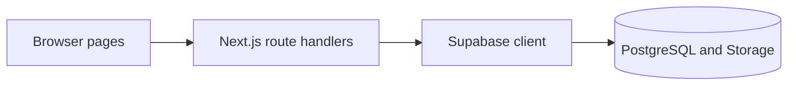

# Autopilot POS

> A private point-of-sale workflow prototype for products, orders, sales, invoices, and reports.

[](#project-status)
[](https://nextjs.org/)
[](https://www.typescriptlang.org/)
[](#license)

[Overview](#overview) | [Project Status](#project-status) | [Setup](#local-setup) | [Architecture](#architecture) | [Security](SECURITY.md) | [Issues](https://github.com/itsmebillah/autopilot-pos-saas/issues)

## Overview

Autopilot POS explores the core interface and data flows of a small-business point-of-sale system. It includes product management, order and invoice screens, dashboard summaries, reports, store settings, and Supabase-backed API routes.

## Implemented Areas

- Product creation, update, deletion, lookup, and stock display
- Cart-based sale capture and invoice numbering
- Dashboard and report queries
- Store settings and logo upload flows
- Responsive Next.js dashboard navigation

## Project Status

This repository is an early prototype, not a production-ready SaaS product. Authentication currently compares credentials against application table values, API routes do not enforce a user session, inputs are not comprehensively validated, and a sale plus its inventory updates are not executed as one database transaction. Keep the repository private and use synthetic data only.

## Technology

Next.js 16, React 19, TypeScript, Tailwind CSS 4, Supabase, Lucide React, and React Hot Toast.

## Local Setup

Requirements: Node.js 20 or newer, npm, and a disposable Supabase development project with the expected tables and storage bucket.

```bash
git clone https://github.com/itsmebillah/autopilot-pos-saas.git
cd autopilot-pos-saas
npm ci
```

Copy `.env.example` to `.env.local`, provide the browser-safe Supabase project values, and start the application:

```bash
npm run dev
```

Open `http://localhost:3000`. A database schema or migration set is not included, so a fresh environment cannot yet be reproduced from this repository alone.

## Architecture



## Repository Structure

```text
app/          Pages and API route handlers
components/   Dashboard navigation
lib/          Supabase client configuration
public/       Static assets
```

## Roadmap

- Replace table-based password checks with Supabase Auth and secure cookies
- Enforce authenticated tenant and role checks on every API operation
- Add schema migrations and Row Level Security tests
- Validate requests and use transactional server-side sale processing
- Add unit, integration, and end-to-end test coverage
- Add CI, monitoring, backup, and restore procedures

## License

No open-source license has been selected. All rights remain with the repository owner unless a license is added.

---

**Md. Masum Billah** · Data Analyst | Automation Developer | Business Intelligence Specialist

[Portfolio](https://itsmebillah.github.io/) · [GitHub](https://github.com/itsmebillah) · [Email](mailto:itsmbillah@gmail.com) · [Related Projects](https://github.com/itsmebillah?tab=repositories) · [Security](SECURITY.md) · [Issues](https://github.com/itsmebillah/autopilot-pos-saas/issues)
